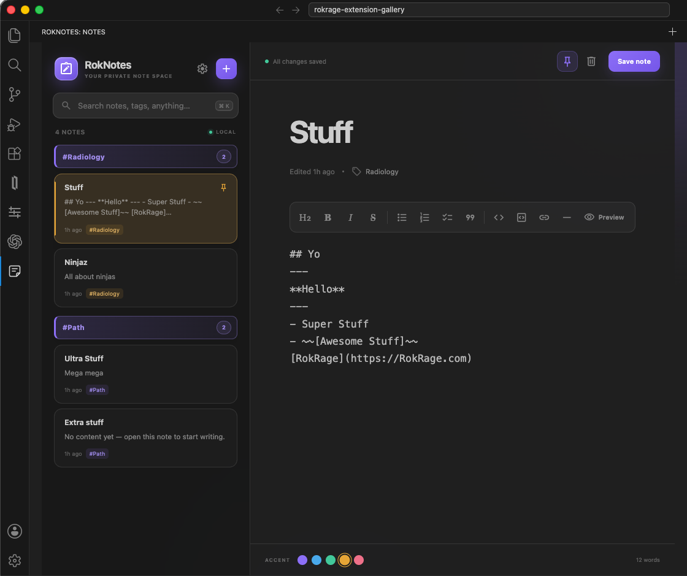
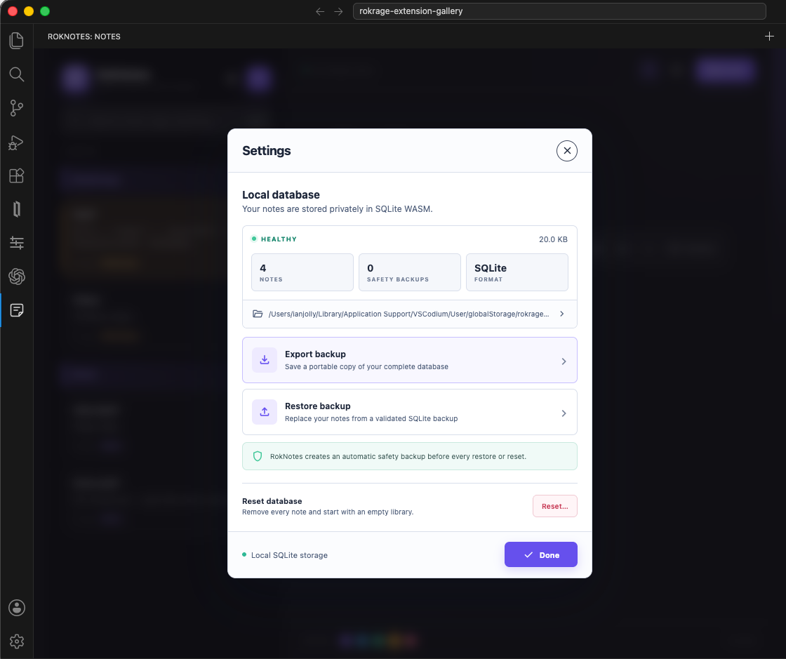
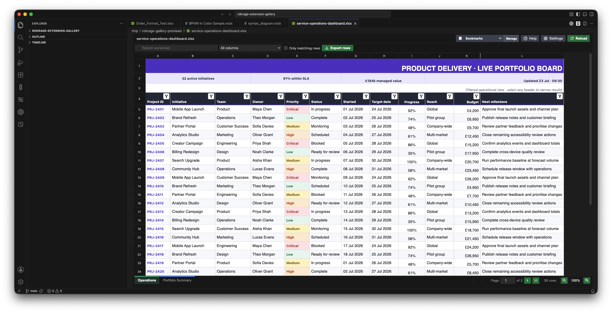
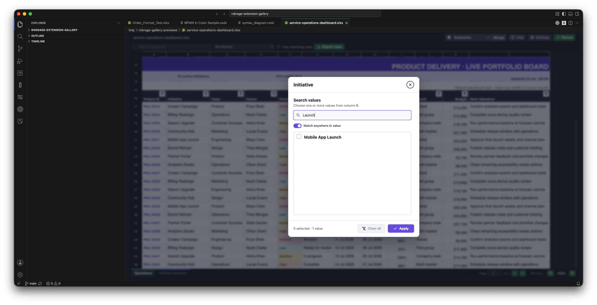
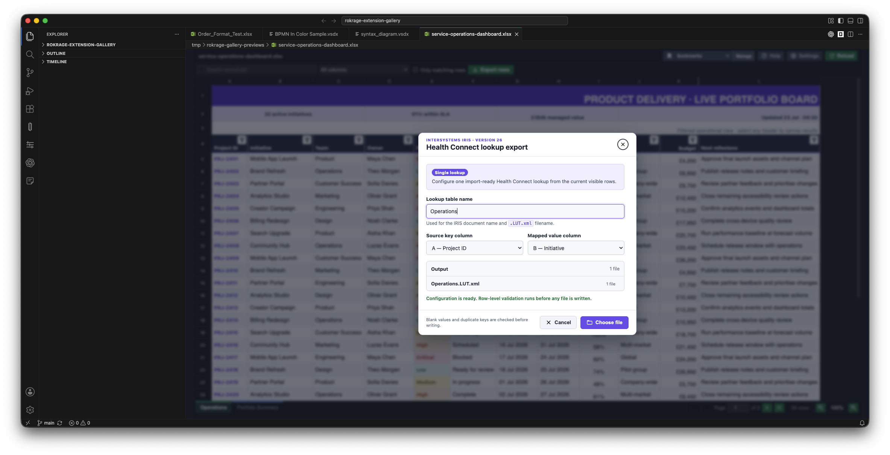
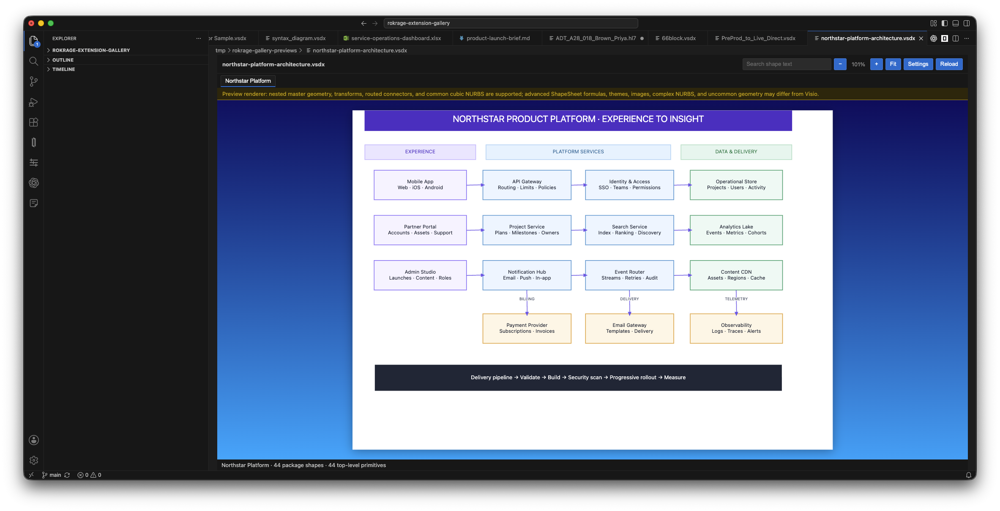
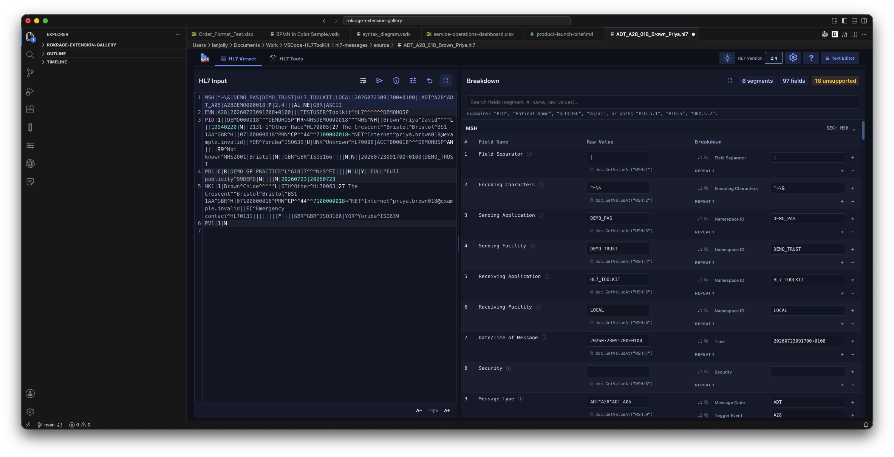
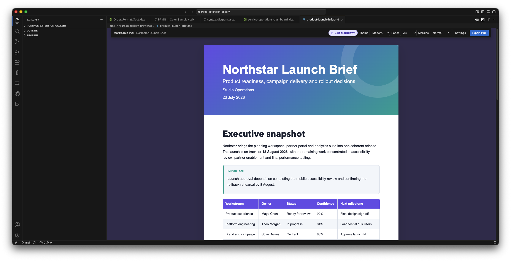

# RokRage Extension Gallery

Public image assets for RokRage extension listings and README files.

## Gallery structure

```text
rokrage-extension-gallery/
├── roknotes/
├── excel-viewer/
├── vsdx-viewer/
├── hl7-toolkit/
└── markdown-pdf/
```

Each extension directory contains only the screenshots and artwork used by that
extension's public documentation. Extension source code does not belong in this
repository.

## Using an image

Reference files through GitHub's stable raw-content URL:

```markdown

```

Use lowercase, descriptive filenames such as `hero.png`, `editor.png`, and
`settings.png`. Prefer PNG for screenshots and SVG only for artwork that needs
to scale.

## RokNotes

### Searchable notes workspace



### Local database settings



## RokRage Excel Viewer

### Detailed product-delivery workbook



### Searchable multi-select filters



### Health Connect lookup export



## RokRage VSDX Viewer

### Product-platform architecture



## RokRage HL7 Toolkit

### Editable message viewer and field breakdown



## Stylish Markdown PDF

### Styled launch brief


